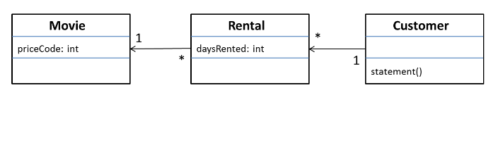
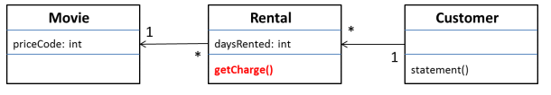
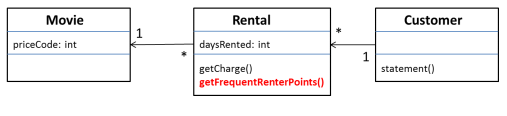
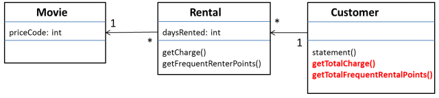
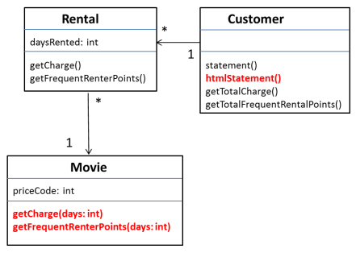
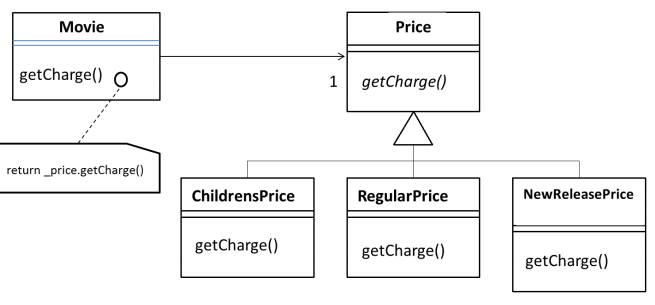
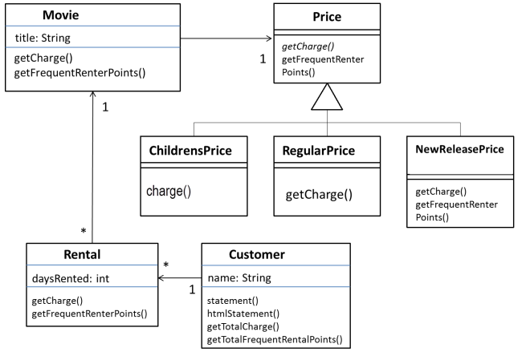

_Übungsaufgabe zur Veranstaltung [Objektorientiertes Programmieren](https://hsro-wif-oop.github.io) im [Bachelorstudiengang Wirtschaftsinformatik](https://www.th-rosenheim.de/technik/informatik-mathematik/wirtschaftsinformatik-bachelor/) an der [Hochschule Rosenheim](http://www.th-rosenheim.de)._

# Übung 11: Refactoring und Design Pattern


Refactoring ist eine Technik zur Verbesserung der Qualität von vorhandenem Code. Es funktioniert durch Anwenden einer Reihe von kleinen Schritten, von denen jeder die interne Struktur
des Codes unter Beibehaltung seines äußeren Verhaltens ändert.

Sie beginnen mit einem Programm, das korrekt ausgeführt wird, aber nicht gut strukturiert ist. Refactoring verbessert die Struktur, wodurch es einfacher wird, das Programm zu pflegen und zu erweitern.

## Der Startpunkt

Das Beispielprogramm ist recht überschaubar. Es ist ein Programm zu
berechnen und drucken des Beleges eines Kunden in einem Videogeschäft.

Dem Programm wird mitgeteilt, welche Filme ein Kunde wie lange ausgeliehen hat. Es berechnet dann die Gebühren, die davon abhängen, wie lange der Film ausgeliehen wurde und identifiziert die Art des Films. 

Es gibt 3 Arten von Filmen: 
- normale Filme
- Kinderfilme 
- Neuerscheinungen

Neben der Berechnung der Gebühren werden in der Abrechnung  Bonuspunkte berechnet, die abhängig davon abhängen, ob der Film eine Neuerscheinung ist.

Hier ein Klassendiagramm:




Wir werden nun diese Programm Schritt für Schritt überarbeiten. Glücklicherweise gibt es bereits einen TestCase. Schauen Sie sich diesen an, um zu verstehen, was das Programm überhaupt macht.

## Aufgabe 1: Extracting the Amount Calculation

Das offensichtliche erste Ziel ist die zu lange `statement()`-Methode des Customer. Aus eine solchen Methode sollte ein Teil des Codes herausgenommen werden und eine Methode daraus extrahieren. Das Extrahieren einer Methode bedeutet, den Code zu entnehmen und daraus eine Methode zu machen. Ein offensichtliches Stück hier ist die switch-Anweisung:

```java
            //determine amounts for each line
            switch (each.getMovie().getPriceCode()) {
                case Movie.REGULAR:
                    thisAmount += 2;
                    if (each.getDaysRented() > 2)
                    thisAmount += (each.getDaysRented() - 2) * 1.5;
                    break;
                case Movie.NEW_RELEASE:
                    thisAmount += each.getDaysRented() * 3;
                    break;
                case Movie.CHILDREN:
                    thisAmount += 1.5;
                    if (each.getDaysRented() > 3)
                    thisAmount += (each.getDaysRented() - 3) * 1.5;
                    break;
            } 
```

Dies sieht so aus, als würde es einen guten Teil ergeben, der in seine eigene Methode extrahiert werden kann. Wenn wir eine Methode extrahieren,müssen wir im Fragment nach Variablen suchen, deren Gültigkeitsbereich lokal für die Methode ist, die wir betrachten, also nach lokalen Variablen und Parametern. 

Dieses Codesegment verwendet zwei: `each` und `thisAmount`. Von diesen wird `each` nicht durch den Code geändert, sondern nur `thisAmount`.  

Die Extraktion sieht so aus:

- Wir führen eine neue Methode `amountFor`
- und ersetzen den Aufruf in der der `statemetn()`-Methode

```java
private int amountFor(Rental each) {

 int thisAmount = 0;

 switch (each.getMovie().getPriceCode()) {
 	case Movie.REGULAR:
 		thisAmount += 2;
 		if (each.getDaysRented() > 2)
 			thisAmount += (each.getDaysRented() - 2) * 1.5;
 		break;
 	case Movie.NEW_RELEASE:
 		thisAmount += each.getDaysRented() * 3;
 		break;
 	case Movie.CHILDREN:
 		thisAmount += 1.5;
 		if (each.getDaysRented() > 3)
 			thisAmount += (each.getDaysRented() - 3) * 1.5;
 		break;
 	}
 return thisAmount;
} 
```

```java
while (rentals.hasMoreElements()) {
	double thisAmount = 0;
	Rental each = (Rental) rentals.nextElement();
	//determine amounts for each line
	thisAmount = amountFor(each);
	...
```

Test laufen lassen und schauen, ob die Änderung etwas verändert hat!

## Aufgabe 2: Umbenennen (Rename)

Es bietet sich an in `AmountFor`den Parameter umzubennen von `each` in `aRental` und das Attribut `thisAmount` in `result`. Dananch Sieht der Code wie folgt aus:

```java
private int amountFor(Rental aRental) {

 int result = 0;

 switch (aRental.getMovie().getPriceCode()) {
 	case Movie.REGULAR:
 		result += 2;
 		if (aRental.getDaysRented() > 2)
 			result += (aRental.getDaysRented() - 2) * 1.5;
 		break;
 	case Movie.NEW_RELEASE:
 		result += aRental.getDaysRented() * 3;
 		break;
 	case Movie.CHILDREN:
 		result += 1.5;
 		if (aRental.getDaysRented() > 3)
 			result += (aRental.getDaysRented() - 3) * 1.5;
 		break;
 	}
 return result;
} 
```

Tests laufen lassen!

## Aufgabe 3: Moving amount calculation

Sieht man sich `amountFor` an, sieht man, dass Informationen aus `Rental` verwendet werden, aber keine Informationen vom `Customer`. In den meisten Fällen sollte sich eine Methode auf dem Objekt befinden, dessen Daten es verwendet. Befindet sich diese Methode also auf dem falschen Objekt, sollte sie in `Rental` verschoben werden.

Also den Code nach `Rental`:

```java
class Rental...
	double getCharge() {
		double result = 0;
		switch (getMovie().getPriceCode()) {
			case Movie.REGULAR:
				result += 2;
				if (getDaysRented() > 2)
					result += (getDaysRented() - 2) * 1.5;
				break;
			case Movie.NEW_RELEASE:
				result += getDaysRented() * 3;
				break;
			case Movie.CHILDREN:
				result += 1.5;
				if (getDaysRented() > 3)
					result += (getDaysRented() - 3) * 1.5;
				break;
		}
	return result;
}
```

Und in `Customer`nur noch den Aufruf:

```java

class Customer
	...
	private double amountFor(Rental aRental) {
		return aRental.getCharge();

}
```

Tests laufen lassen!

Und nun könne wir sogar noch:

```java
	//determine amounts for each line
	thisAmount = amountFor(each); 
```

durch

```java
	//determine amounts for each line
	thisAmount = each.getCharge(); 
```

ersetzen!

Nun sieht unser Model so aus:



Final können wir hier noch ein paar Zeilen löschen und ersetzen:

```java
public String statement() {

			double totalAmount = 0;
			int frequentRenterPoints = 0;
			Enumeration rentals = _rentals.elements();
			String result = "Rental Record for " + name() + "\n";
			while (rentals.hasMoreElements()) {
löschen -->		double thisAmount = 0;
				Rental each = (Rental) rentals.nextElement();
löschen -->		//determine amounts for each line
löschen -->		thisAmount = each.getCharge();
				// add frequent renter points
				frequentRenterPoints ++;

				// add bonus for a two day new release rental
				if ((each.getMovie().getPriceCode() == Movie.NEW_RELEASE) && each.getDaysRented() > 1) frequentRenterPoints ++;
				//show figures for this rental
change -->			result += "\t" + each.getMovie().getTitle()+ "\t" + String.valueOf(each.getCharge()) + "\n";
change -->		totalAmount += each.getCharge();
			}
			//add footer lines
			result += "Amount owed is " + String.valueOf(totalAmount) + "\n";
			result += "You earned " + String.valueOf(frequentRenterPoints) + " frequent renter points";
			return result;
```


## Aufgabe 4: Extracting Frequent Renter Points

Im nächsten Schritt machen wir das Gleiche für die `frequentRenterPoints`. Zunächst wird eine Methode extrahiert und schieben dies gleich in `Rental`:

```java
class Rental...
	int getFrequentRenterPoints() {
		if ((getMovie().getPriceCode() == Movie.NEW_RELEASE) && getDaysRented() > 1)
			return 2;
		else
			return 1;
	} 
```

Und in der Customer Klasse in der `statement`-Methode ersetzen:

```java
	while (rentals.hasMoreElements()) {
		Rental each = (Rental) rentals.nextElement();
		frequentRenterPoints += each.getFrequentRenterPoints(); 
```

Modell sieht so aus:



Ach ja, Tests laufen lassen!

## Aufgabe 5: Removing Temps

Als nächsten Schritt schmeissen wir ein paar temporäre Variablen in Customer raus.

Wir führen folgende Methode ein in Customer ein:

```java
private double getTotalCharge(){

	double result = 0;
	Enumeration rentals = _rentals.elements();

	while (rentals.hasMoreElements()) {
		Rental each = (Rental) rentals.nextElement();
		result += each.getCharge();
	}
	return result;
}

private double getTotalFrequentRenterPoints(){

	double result = 0;
	Enumeration rentals = _rentals.elements();

	while (rentals.hasMoreElements()) {
		Rental each = (Rental) rentals.nextElement();
		result += each.getFrequentRenterPoints();
	}
	return result;
} 
```

und machen folgendes in der `statement`-Methode:

```java
public String statement() {

löschen --> 	double totalAmount = 0;
löschen --> 	int frequentRenterPoints = 0;
				Enumeration rentals = _rentals.elements();
				String result = "Rental Record for " + name() + "\n";
				while (rentals.hasMoreElements()) {
					Rental each = (Rental) rentals.nextElement();
löschen -->			frequentRenterPoints += each.getFrequentRenterPoints();

					//show figures for this rental
					result += "\t" + each.getMovie().getTitle()+ "\t" + String.valueOf(getCharge()) + "\n";
löschen -->			totalAmount += each.getCharge();
				}
				//add footer lines
change -->		result += "Amount owed is " + String.valueOf(getTotalCharge()) + "\n";
change -->		result += "You earned " + String.valueOf(getTotalFrequentRenterPoints()) + " frequent renter points";
				return result;
}
```

Das Modell dazu:



## Aufgabe 6: Replacing the Conditional Logic on Price Code with Polymorphism

Nun kommt mein Lieblingsthema. Wir werden das switch-Statement durch Polymorphie ersetzen.

Zunächste verschieben wir die Methode `getCharge` in die `Movie`-Klasse:

```java
Class Movie …
	double getCharge(int daysRented) {

		double result = 0;

		switch (getPriceCode()) {
			case Movie.REGULAR:
				result += 2;
				if (daysRented > 2)
					result += (daysRented - 2) * 1.5;
				break;
			case Movie.NEW_RELEASE:
				result += daysRented * 3;
				break;
			case Movie.CHILDREN:
				result += 1.5;
				if (daysRented > 3)
					result += (daysRented - 3) * 1.5;
				break;
		}
		return result;
	}
```

Damit ändert sich der Aufruf in der `Rental`-Klasse zu:

```java
Class Rental…

	double getCharge() {
		return _movie.getCharge(_daysRented);
	} 
```

Die gleiche Änderung gilt auch für die `getFrequentRenterPoints`-Methode. Auch diese wandert in die `Movie`-Klasse.

Das Modell sieht dann so aus:



Als, nächstes führen wir eine `Price`-Klasse ein. Das soll im Klassendiagramm so aussehen:



Die `Movie`-Klasse ändern wir, wie folgt:

```java
public class Movie {

	private Price _price; 

	public Movie(String title, int priceCode) {
		_title = title;
		setPriceCode(priceCode);
	}

	public int getPriceCode() {
		return _price.getPriceCode();
	}

	public void setPriceCode(int arg) {
		switch (arg) {
			case Movie.REGULAR:
				_price = new RegularPrice();
				break;
			case Movie.CHILDREN:
				_price = new ChildrensPrice();
				break;
			case Movie.NEW_RELEASE:
				_price = new NewReleasePrice();
				break;
			default:
				throw new IllegalArgumentException(“Incorrect Price Code”);
		}
	}
```

Für die `Price`-Klassen git:

```java
abstract class Price {
	abstract int getPriceCode() {
}

class ChildrensPrice extends Price {
	int getPriceCode() {
		Return Movie.CHILDREN;
	}
}

class NewReleasePrice extends Price {
	int getPriceCode() {
		Return Movie.NEW_RELEASE;
	}
}

class RegularPrice extends Price {
	int getPriceCode() {
		Return Movie.REGULAR;
	}
} 
```

Nun, spendieren wir der `Price`-Basisklasse eine abstrakte Methode `abstract double getCharge(int dasyRented)`. In den Unterklassen können wir nun den Code aus der `getCharge`-Methode in `Movie` in die `Price`-Klassen umziehen:

```java
class RegularPrice…

 double getCharge(int daysRented) {
	double result = 2;
	if (daysRented > 2)
		result += (daysRented - 2) * 1.5;
	return result;
 }


class ChildrensPrice…
	double charge(int daysRented){
		double result = 1.5;
		if (daysRented > 3)
			result += (daysRented - 3) * 1.5;
		return result;
	} 

class NewReleasePrice…
	double charge(int daysRented){
		return daysRented * 3;
	} 

```

Damit reduziert sich der Aufruf in der `Movie`-Klasse zu:

```java
class Movie …

	double getCharge(int daysRented) {
		return _price.getCharge(daysRented);
	}

```

Den gleichen Spass machen wir mit der `getFrequentRenterPoints`-Methode. Das Schöne hier ist, dass nur `NewReleasePrice` eine spezielle Implementierung benötigt, während die Basisfunktionalität in in der Basisklasse `Price`passieren kann.

Testen nicht vergessen!!!!

## Ende

Das Modell sieht nun so aus:



Done!